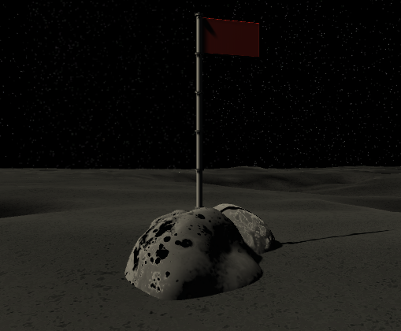
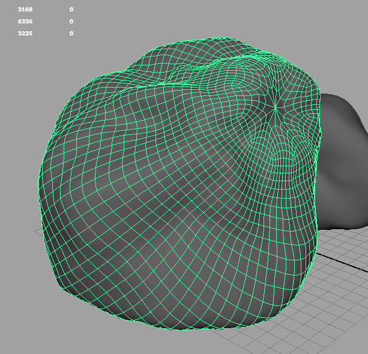
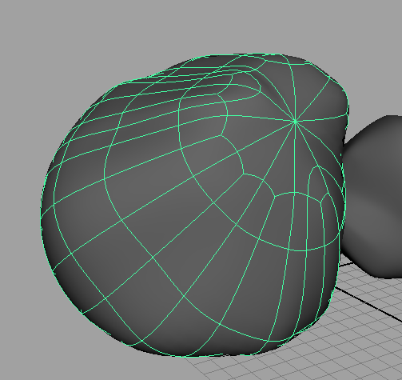
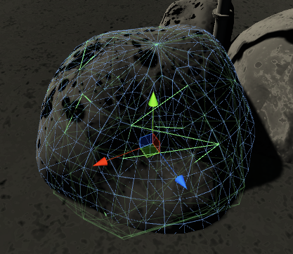
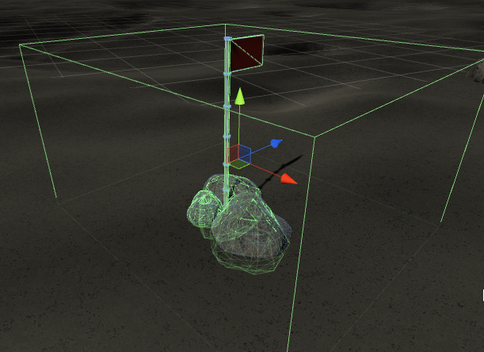

##Using Low-Poly Mesh Colliders On High-Poly Models

####By Paul MacCarty

I spent a lot of time planning and crafting the models and textures in my scene.  As a first-time designer, I hadn't thought
about any sort of colliders until I actually brought the assets in for the first time.  On my first play-through, I realized
I could walk straight through my models.  In some cases, namely the flags or markers, I could just drop a box collider on and
that would do the trick. The real trouble came when I wanted to integrate colliders for my high-poly rock formations.

I had some general idea of how to go about it, but first referenced the [Unity Forum]
(http://answers.unity3d.com/questions/771847/use-low-poly-collision-mesh-for-a-high-poly-model.html).

Since I had already coupled the rocks in pairs and prefabbed them with their flags in 4 different outcroppings,
I didn't want to have to double back and redo everything from scratch.  Instead, I launched my rock scenes in Maya
and saved out new FBX files for each of the 12 rocks.  The only difference this time was that I made sure to select
each mesh and in the Polygon Menu-Set, select Mesh > Reduce (Options Box) and reduce the quality of my mesh by 75%.

######Original:

######Reduced:

With two separate FBX exports for each rock, I then set about applying the Reduced mesh to each respective rock
within a mesh collider.  The result is much more in tune with what I wanted, as each rock outcropping deforms in
a very specific way.  When a player decides to jump on the flags, rocks or even the ship, I wanted the collider
result to be as realistic as possible.

######Combined Mesh and Collider:

Now, if and when I select each prefab that includes a flag and a grouping of 3 different rocks, the result is this:

I hope this 'tutorial' helps because it drastically improved the performance of my game and also prevented my computer
or hard drive from exploding!
